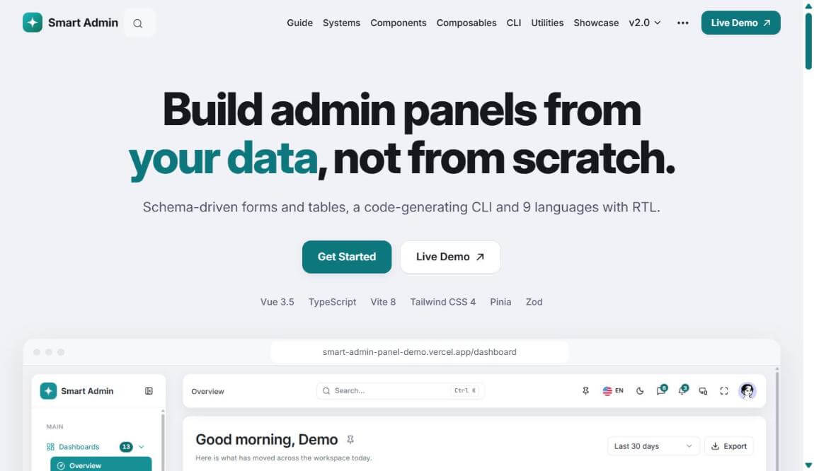
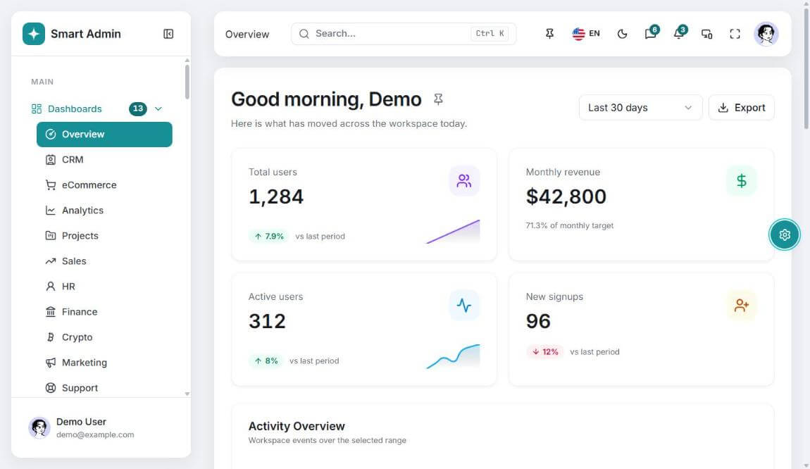
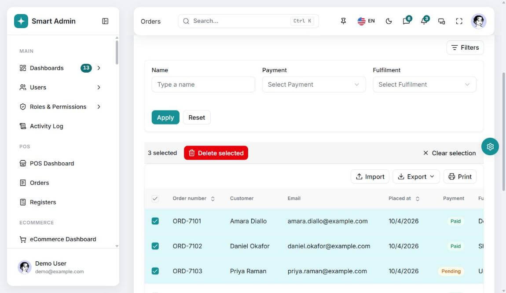
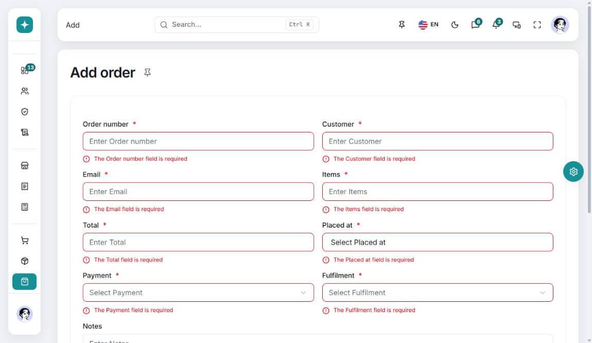
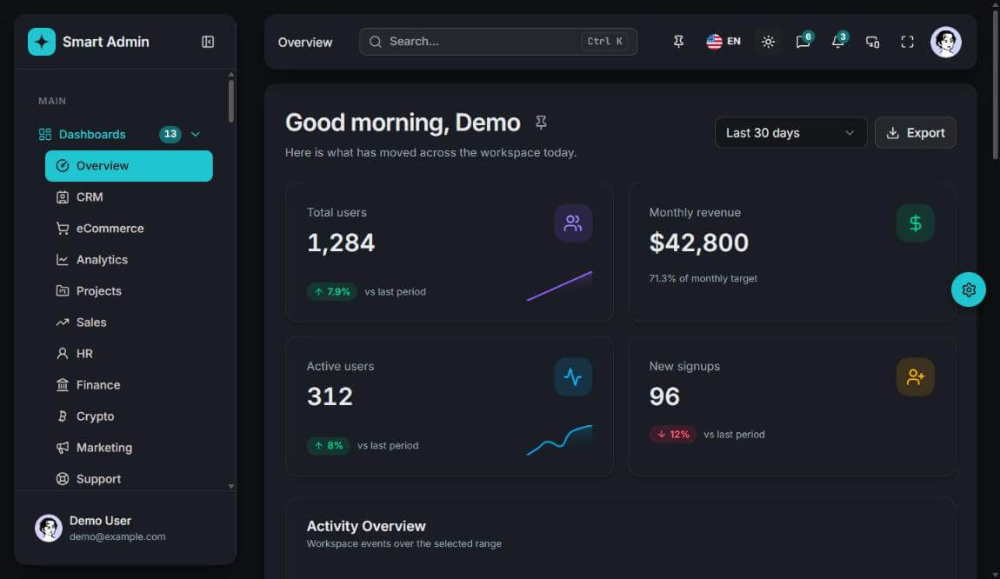
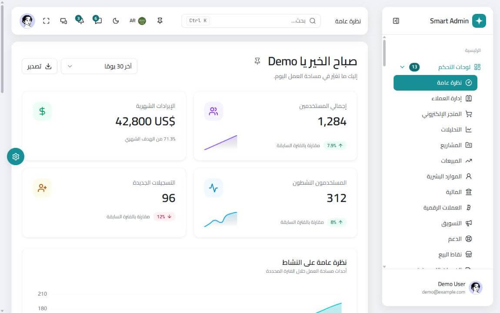
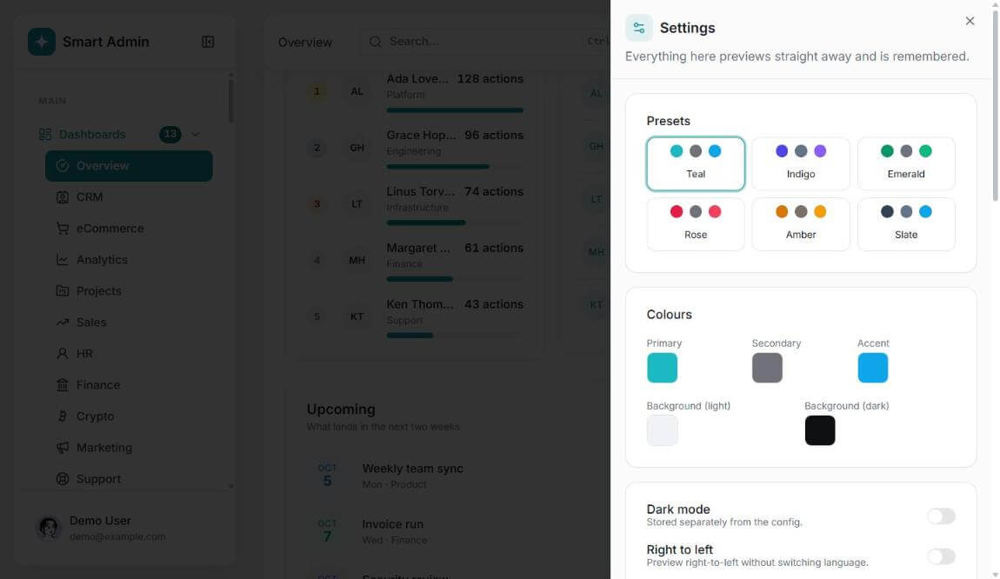

# Smart Admin Panel

A commercial schema-driven admin template built with Vue 3, Vite, and strict TypeScript. One schema definition drives the form, its validation, the table, and the filters, and a CLI scaffolds new modules straight from a real API contract.

[Live demo](https://smart-admin-panel-demo.vercel.app) · [Documentation](https://smart-admin-panel-docs.vercel.app)

> Source code is private. This repository is a showcase.

## What it does

- **Schema-driven** — a single `FieldDefinition[]` drives forms, validation, tables, and filters
- **Code-generating CLI** — nine commands that scaffold modules and forms from your own API contract instead of mock data, generating types, Zod schemas, accessible forms, and translation keys
- **40+ CRUD modules** with data tables, filtering, search, import/export, print, pagination, and bulk actions
- **13 dashboards** covering analytics, CRM, eCommerce, POS, finance, HR, and more
- **9 languages with full RTL**, including runtime locale discovery and end-to-end locale add and remove
- **CASL-based RBAC** with permission directives
- **Token-driven theming** — color presets, density, typography scale, and dynamic fonts
- **Built-in accessibility** in the form engine, with ARIA and focus management
- **Full hosted documentation** that ships with the template

## Stack

Vue 3.5 · Vite · TypeScript (strict) · Pinia · vue-router · Tailwind CSS 4 · shadcn-vue · vee-validate + Zod · CASL · ECharts · Tiptap · vue-i18n

## Screens

**Dashboard**

**Data tables with filtering and bulk actions**

**Schema-driven forms with generated validation**

**Dark mode**

**Arabic with full RTL**

**Theme customizer**

More screens, including the calendar, Kanban board, chat, POS, and invoicing modules, are in [screenshots](screenshots).

## Built by

[Mohamed Almearag](https://almearag-portfolio.vercel.app) · Senior Frontend Engineer
